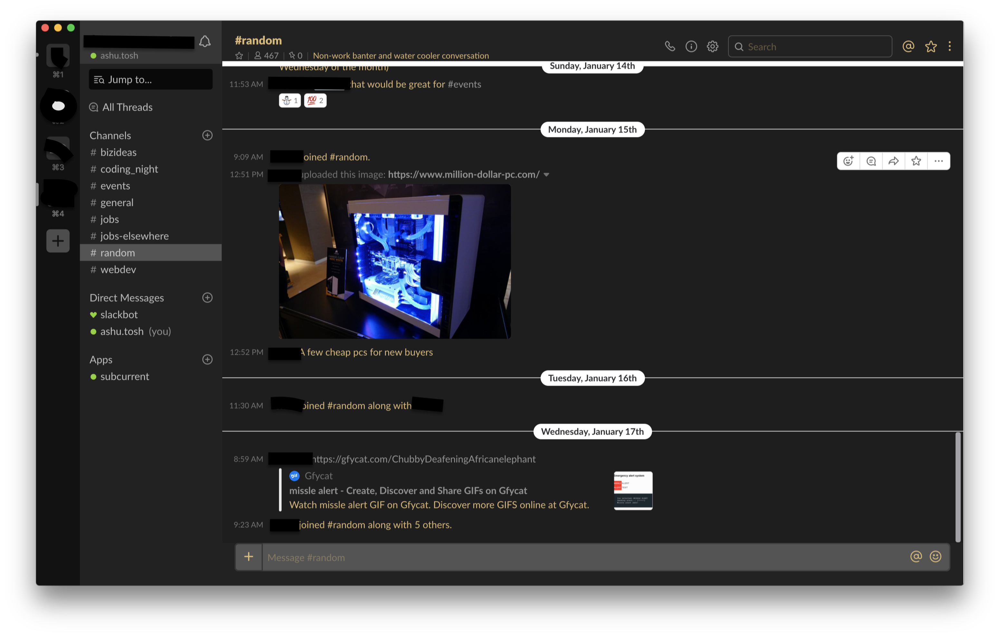

# slack-dark-theme

## Installing into slack

Find your Slack's application directory.

* Windows: `%homepath%\AppData\Local\slack\`
* Mac: `/Applications/Slack.app/Contents/`
* Linux: `/usr/lib/slack/` (Debian-based)

Navigate to the latest installed version and then open the following file in your favorite editor `resources/app.asar.unpacked/src/static/ssb-interop.js`

Add the following code at the end of the file
```js
document.addEventListener('DOMContentLoaded', function() {
 $.ajax({
   url: 'https://raw.githubusercontent.com/ashutosh-shirole/slack-dark-theme/master/dark.css',
   success: function(css) {
     $("<style></style>").appendTo('head').html(css);
   }
 });
});
```

And thats it. Reload slack `Ctrl+R` and you should get a dark theme.

You will have to do this everytime you install/update your slack.

### Sidebar theme
If above changes dont change sidebar make the following changes
1. go to: `Slack Preferences > Sidebar > Theme`
2. Clear the textbox for custom theme 
3. Paste the following contents in the textbox

```
#222222,#444A47,#D39B46,#FFFFFF,#434745,#FFFFFF,#99D04A,#DB6668
```
**IMPORTANT NOTE** This workaround will request CSS file from this repository. Using remote CSS file can be a risk. Recommended way is to create a local copy of the css file and use that file.

## Shell script for linux
If you find following these steps tedious on every update I have added a shell script `enable_slack_dark_mode.sh` which can be run on every update of slack.
This is only for linux and can be adapted for other OS too. Feel free to adapt/contribute.

## Screenshot



## Development
For slack developer tools one has to open slack in developer mode. To do that use (for macOs):
```sh
export SLACK_DEVELOPER_MENU=true && open /Applications/Slack.app
```

## Credits
Adapted from [slack-night-mode](https://github.com/laCour/slack-night-mode)
